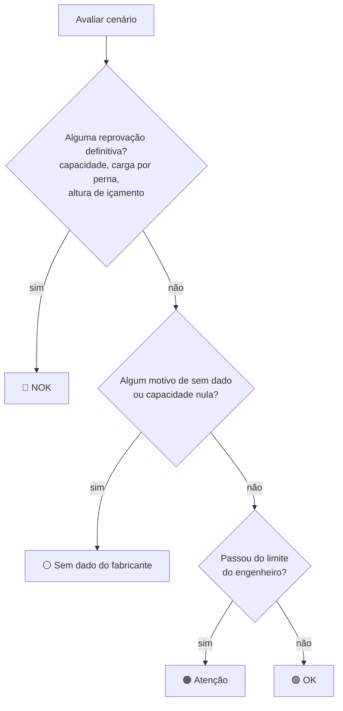

# ⚖️ Regras de Negócio

> [!danger] Estas regras não podem ser quebradas
> Todo resultado do simulador vira decisão de içamento. Qualquer mudança no motor de cálculo precisa respeitar as regras abaixo e vir com teste usando valores **reais** das tabelas.

## 1. Regra de ouro (RF17)

| Situação | Resultado |
|---|---|
| A configuração cai **exatamente** num ponto da tabela | O valor da tabela, exato |
| Fica **entre** pontos tabelados | Interpolação linear, **arredondada para baixo** |
| Fica **fora da cobertura** da tabela | Status `sem_dado`, com o motivo. **Nunca** um valor inventado ou extrapolado |

Exemplos de "fora da cobertura": sapata com extensão diferente da máxima, nº de pernas do cabo diferente do previsto, JIB com a lança fora de 32,10 m, offset do JIB fora de 10–40°, raio sem célula na tabela, giro além do limite mecânico, dado essencial não informado (massa linear do cabo, nº de pernas).

O mapa da área de operação ([[🖥️ Interface#Mapa da área de operação]]) segue a mesma regra porque chama o mesmo motor.

## 2. Somatório de cargas (RF09/RF10/RF20)

A capacidade é comparada com o **somatório**, nunca com a carga isolada. A regra vem da planilha de cálculo da própria Ribas (`docs/Informações gerais - içamento.xlsx`).

$$
\text{Somatório} = \text{carga} + \text{lingada} + \text{cabo de içamento} + \text{balancim} + \max(0,\ \text{moitão} - \text{gancho já incluído na tabela})
$$

- **Cabo de içamento** = comprimento pendente por perna × nº de pernas × massa linear. O comprimento pendente é o pior caso: carga apoiada no solo. O valor calculado fica sempre visível e pode ser sobrescrito.
- A "massa do cabo de aço" da planilha é o **cabo de içamento pendurado** (a lingada da Ribas é feita de cintas, sem cabo de aço).
- **Moitão:** a tabela do MD-300L já inclui o gancho (235 kg na lança principal, 67 kg no JIB); só o excedente entra. No TM-130 a ficha não diz, então a massa informada entra inteira.

## 3. Arredondamento de segurança (RT-MC05)

Todo valor interpolado é arredondado **para baixo** (kg inteiro). Nunca ser otimista com a capacidade. Uma tolerância de ruído numérico de 1e-6 kg evita perder 1 kg por erro de ponto flutuante (18.349,9999999 → 18.350); qualquer diferença real continua indo para baixo.

## 4. Unidade

O cálculo interno é **sempre em kg** (kgf e kg tratados como equivalentes: é só rótulo, não há conversão). A interface mostra em kg ou t (RF14), sem mudar o cálculo.

## 5. Área de giro (RF18)

O quadrante (MD-300L) ou a zona (TM-130) é **derivado do giro** da superestrutura. Os limites vivem num único arquivo, `app/src/config/criteriosDeGiro.ts`:

| Guindaste | 0° aponta para | Setores (vale \|giro\|) | Limite mecânico | Fonte |
|---|---|---|---|---|
| MD-300L | Frente do caminhão (cabine) | Frontal ≤ 55° · Lateral/traseira até 180° | 360° contínuo | Setores de 110° e 250° da ficha (p.3) e Figuras A/B da planilha. **Confirmado em 06/10/2026** |
| TM-130 | 0° do diagrama polar (desenhado para a traseira por convenção) | Zona I ≤ 16° · Zona II ≤ 60° | ±60° (giro total de 120°) | Diagrama polar da ficha (p.2) |

- **Na fronteira exata** (ex.: 55°, 16°) o motor avalia as duas áreas e fica com a **menor** capacidade.
- Não se interpola entre zonas: são regiões discretas.
- Cada cenário salvo guarda a `VERSAO_CRITERIO_GIRO` (hoje `2026-10-06-1`).

## 6. Sapatas

Parametrizáveis uma a uma, mas **só a extensão máxima** tem capacidade nas fichas ("cargas calculadas com sapatas na extensão máxima, terreno plano e firme"). Qualquer outra extensão → sem dado.

## 7. JIB

- Só o **MD-300L** está habilitado (`possuiJIB = true`).
- Comprimentos discretos: **9,0 / 15,5 / 20,0 m** (seções montadas). Exige a lança principal em **32,10 m**.
- Offset 10° / 25° / 40° tabelado; entre eles, interpolação para baixo; fora de 10–40° → sem dado.
- O TM-130 tem tabela de JIB (5,1 m) na ficha, mas fica **desligado** até a Ribas confirmar se a unidade tem o acessório.

## 8. Passagem de cabo

- MD-300L: a tabela vale para 8 pernas (10,50 / 14,10 m), 6 pernas (17,70 / 21,30 / 24,90 m) e 4 pernas (28,50 / 32,10 m); JIB 1 perna. Outro nº → sem dado.
- TM-130: a ficha **não informa**. O campo começa vazio → sem dado. Nunca deduzir pelas 3 roldanas da lança.
- Verificação extra da ficha: somatório ≤ pernas × carga por perna (MD-300L 3.900 kgf; TM-130 4.300 kgf).

## 9. Busca reversa (RF15)

A lista de configurações viáveis é ordenada pelo **menor guindaste primeiro** (capacidade nominal: TM-130 26 t antes do MD-300L 30 t), nunca pelo maior.

## 10. Status final

Uma reprovação que não depende da tabela (ex.: carga por perna estourada) é definitiva mesmo quando falta dado; por isso ela vem antes do "sem dado".

## 11. Frota

Fechada em **2 guindastes** (MD-300L e TM-130) neste MVP. Cadastro de novos modelos é o Épico 6.

## Relacionado

- [[📐 Requisitos]]
- [[📊 Tabelas de Carga e Fontes]]
- [[🗳️ Decisões e Configuração]]
- [[❓ Pendências com a Ribas]]
