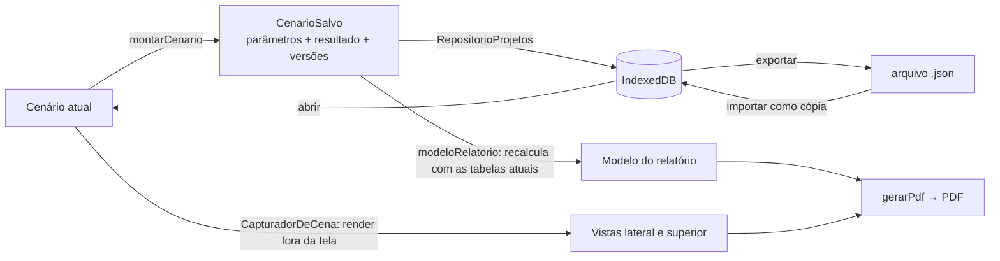

# 🏗️ Arquitetura e Stack

## Decisão: aplicação web

Confirmado em 20/08/2026: **web app**, não executável desktop.

- Sem instalação: a banca e a empresa acessam por um link.
- Roda em qualquer sistema com navegador.
- Interação gráfica (arrasto, 3D) tem a mesma qualidade de uma aplicação desktop.
- Deploy estático gratuito (Vercel/Netlify).
- Se aparecer a exigência de uso **offline** (ex.: na cabine, sem internet), a mesma aplicação vira um **PWA** sem reescrever nada. Os dados já ficam no navegador (IndexedDB).

## Stack

| Camada | Tecnologia | Por quê |
|---|---|---|
| UI | **React 19 + TypeScript 6 + Vite 8** | Componentes, tipagem forte no cálculo, build rápido |
| Cena 3D | **three.js + react-three-fiber + drei** | WebGL real, arrasto de peças, cubo de orientação e rótulos HTML prontos |
| Ícones | **lucide-react** | SVG, gratuito, leve; usado no CommandManager, árvore e barras (Épico 17) |
| Estado | **Zustand** | Leve; uma store com o cenário como único estado editável |
| Motor de cálculo | **TypeScript puro** (`app/src/engine/`) | Sem dependência de UI, então dá para testar isolado |
| Dados | **JSON** por guindaste (tabelas + especificações) | Fácil de versionar e conferir; cada valor com fonte |
| Persistência | **IndexedDB** com a lib `idb` (~1 kB) | Offline, sem servidor e sem login; troca por backend é uma linha |
| Relatório | **jsPDF + jspdf-autotable** | PDF no navegador; carregados sob demanda (chunk de ~400 kB) |
| Testes | **Vitest** (unitário) + **Playwright** (e2e com arrasto real) + `fake-indexeddb` | Ver [[🧪 Plano de Testes]] |
| Lint | **oxlint** | Rápido; roda no `npm run lint` |
| Deploy | Vercel ou Netlify (estático) | Pendente, ver [[✅ Próximos Passos]] |

A stack original (Épicos 0–6) usava **react-konva** (2D). Ela foi trocada por three.js no Épico 7, a pedido do Gustavo ("uma terceira dimensão"), sem mudar o motor.

## Módulos

1. **Motor de cálculo** (`engine/`): `avaliarCenario` (ponto de entrada único), geometria da lança, interpolação, classificação do giro, busca reversa, mapa da área de operação.
2. **Dados** (`data/`): tabelas de carga, especificações técnicas, `catalogo.ts` (contexto por guindaste + `VERSAO_TABELAS`), validação das especificações.
3. **Configuração** (`config/criteriosDeGiro.ts`): os limites angulares de cada guindaste, num lugar só.
4. **Estado** (`store/`): `useSimulacaoStore` (cenário + avaliação derivada), `useInterfaceStore` (kg/t, vista, diálogos), `useProjetosStore` (projeto/orçamento/cenário aberto).
5. **Interface** (`components/`): `shell/` (barra de título, CommandManager, comandos), `gerenciador/` (FeatureManager, PropertyManager, estado dos nós), viewport 3D (`cena/`, com a barra de vista), `resultado/` (veredito), barra de status, diálogos (`projetos/`).
6. **Persistência** (`persistencia/`): interface `RepositorioProjetos`, implementação IndexedDB, arquivo de projeto (exportar/importar).
7. **Relatório** (`relatorio/`): modelo do relatório (puro), capturas da cena, geração do PDF.

## Estrutura de pastas

```
Jornada/                      ← cofre do Obsidian (estas notas) + repositório
├── 🗂️ … .md                  documentação
├── CLAUDE.md                 instruções para o Claude Code
├── docs/                     fichas e planilhas da empresa, roteiro do pitch, artigo
├── prototipo/                POC vanilla JS/SVG aprovado pela turma
└── app/                      código de produção
    ├── e2e/                  testes Playwright
    └── src/
        ├── engine/           motor de cálculo (TS puro)
        ├── data/             tabelas/*.json, especificacoes/*.json, catalogo.ts
        ├── config/           criteriosDeGiro.ts
        ├── types/            cenario, especificacao, guindaste, projeto
        ├── store/            stores Zustand
        ├── components/       UI (cena/ = módulos da cena 3D; projetos/ = diálogos)
        ├── persistencia/     repositório + arquivo de projeto
        └── relatorio/        modelo + PDF + capturas
```

## Fluxo principal: arrastar o gancho

```mermaid
sequenceDiagram
    actor Eng as Engenheiro
    participant Cena as Cena 3D ou PropertyManager
    participant Store as useSimulacaoStore
    participant Motor as avaliarCenario (engine)
    participant Dados as CATALOGO (tabelas + especificações)
    participant UI as Resultado, cotas, barra de status

    Eng->>Cena: arrasta o gancho
    Cena->>Store: definirAnguloGraus(α) (limitado à ficha)
    Store->>Motor: avaliarCenario(cenario, contexto)
    Motor->>Motor: geometria → raio; giro → área
    Motor->>Dados: capacidade na tabela da área
    Dados-->>Motor: ponto exato / vizinhos / sem célula
    Motor->>Motor: somatório + verificações + status
    Motor-->>Store: avaliacao (derivada, nunca editada)
    Store-->>UI: re-render com o mesmo resultado em todo lugar
    Store-->>Cena: nova pose (frameloop="demand")
```

O ponto central é que o **cenário** (`ParametrosDoCenario`) é o único estado editável. Campo digitado, arrasto na cena, cenário reaberto do banco: tudo escreve no cenário, e a avaliação é sempre recalculada a partir dele. Por isso a árvore, a cena, as cotas, o resultado e o PDF nunca divergem.

## Fluxo: salvar e emitir relatório



## Princípios de arquitetura

- **Motor puro.** `engine/` não importa React, three.js nem a store. É o que permite testá-lo com valores reais.
- **Uma regra, um lugar.** Critérios de giro só em `criteriosDeGiro.ts`; capacidade só no motor (o mapa da área chama `avaliarCenario`, não duplica regra); conteúdo do relatório só em `modeloRelatorio.ts`.
- **Persistência atrás de interface.** A UI conhece `RepositorioProjetos`; trocar IndexedDB por um backend é mudar `persistencia/repositorio.ts`.
- **Dados validados antes do app.** `main.tsx` confere as especificações antes de importar o `App`; um dado quebrado mostra o nome do campo, não uma tela branca.
- **Toda dependência de runtime em `optimizeDeps.include`** (`vite.config.ts`), senão o Vite refaz o pré-empacotamento no meio da sessão (erro 504).

## Relacionado

- [[🗂️ Simulador Guindastes Ribas]]
- [[🗄️ Modelo de Dados]]
- [[🖥️ Interface]]
- [[🗳️ Decisões e Configuração]]
