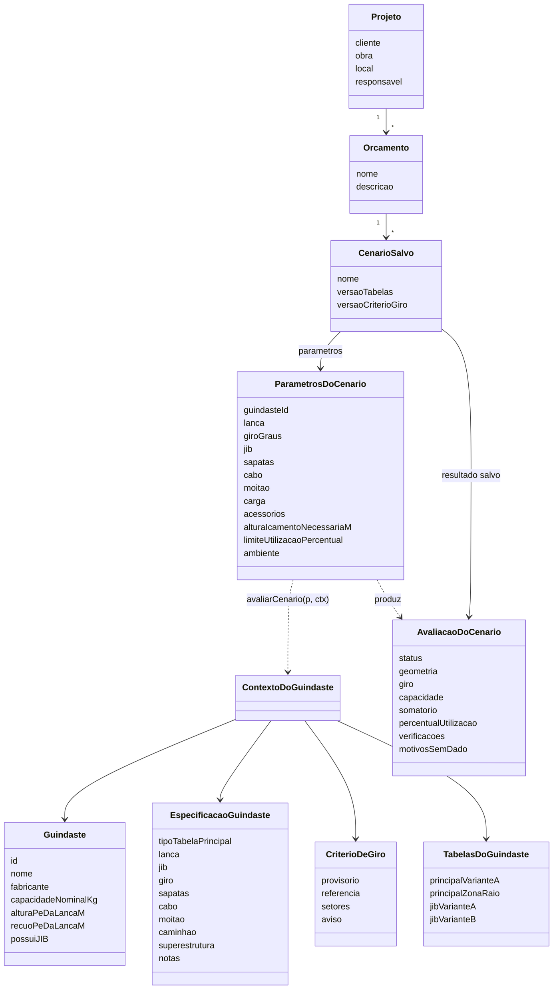

# 🗄️ Modelo de Dados

O ponto central: **os dois guindastes têm tabelas com estruturas diferentes**. Não existe um schema único: o motor conhece cada tipo e despacha pelo `tipoTabelaPrincipal` da especificação.

## Diagrama de classes



O motor recebe só duas coisas: o **cenário** (o que o engenheiro configurou) e o **contexto do guindaste** (dados fixos do fabricante, montado em `data/catalogo.ts`). Ele devolve uma **avaliação** completa. O cenário salvo guarda as duas pontas (parâmetros e resultado) e as versões dos dados, para saber depois com que tabelas aquilo foi calculado.

## Tabelas de carga (`app/src/data/tabelas/`)

| Arquivo | Guindaste | Estrutura | Uso |
|---|---|---|---|
| `md-300l.json` | MD-300L | comprimento (7 valores) × quadrante × pontos `{raioM, capacidadeKgf}` | Lança principal (14 sub-tabelas) |
| `md-300l-jib.json` | MD-300L | comprimento do JIB × offset × quadrante × pontos `{raioM, capacidadeKgf}` | JIB (18 sub-tabelas) |
| `tm-130-principal.json` | TM-130 | zona (`I`/`II`) × pontos `{raioM, capacidadeKg}` | Lança principal (diagrama polar) |
| `tm-130-jib.json` | TM-130 | zona × pontos `{anguloGraus, capacidadeKg}` | JIB (desligado) |
| `tabela-carga.schema.json` | — | JSON Schema das variantes | Documentação/validação |

Exemplo (MD-300L, 10,50 m, frontal):

```json
{
  "guindasteId": "MD-300L",
  "comprimentoLancaM": 10.5,
  "quadrante": "frontal",
  "pontos": [{ "raioM": 3, "capacidadeKgf": 30000 }, { "raioM": 3.5, "capacidadeKgf": 25000 }]
}
```

Exemplo (TM-130, Zona I):

```json
{
  "guindasteId": "TM-130",
  "zona": "I",
  "pontos": [{ "raioM": 5.0, "capacidadeKg": 26000 }, { "raioM": 6.0, "capacidadeKg": 21600 }]
}
```

A origem e a conferência de cada tabela estão em [[📊 Tabelas de Carga e Fontes]].

## Especificações técnicas (`app/src/data/especificacoes/*.json`)

Limites mecânicos, dimensões, passagem de cabo e moitão. **Cada número carrega a sua fonte:**

```json
"anguloMaxGraus": { "valor": 85, "fonte": "ficha p.4 (diagrama de alcance, 85°)" },
"sapataDianteiraM": { "valor": 4.2, "fonte": "aproximado" }
```

- `"fonte": "aproximado"` = não consta nas fichas. Aparece com o selo **≈** na interface e no relatório.
- Campo novo na especificação? Acrescente-o em `VALORES_COM_FONTE` (`data/validarEspecificacao.ts`), senão a validação não o confere.
- Os blocos `caminhao` e `superestrutura` só desenham a cena 3D; não entram na capacidade.

## Cenário (`types/cenario.ts`)

`ParametrosDoCenario` é **o único estado editável** da aplicação:

| Grupo | Campos principais |
|---|---|
| Lança | `comprimentoM`, `anguloGraus` (0° = deitada) |
| Giro | `giroGraus` (normalizado para (−180°, 180°]) |
| JIB | `ativo`, `comprimentoM`, `anguloGraus` (offset para baixo) |
| Sapatas | extensão de cada uma das 4, em m |
| Cabo | `numeroDePernas` (**pode ser `null`**), `massaLinearKgM` (`null` = não informada), `massaSobrescritaKg` |
| Moitão | `massaKg` (`null` = não informada) |
| Carga | descrição, peso, C × L × A, centro de gravidade (dx, dy, dz) |
| Acessórios | lingada (massa e altura), balancim (sim/não e massa) |
| Limites | altura de içamento necessária, limite de utilização (%) |
| Ambiente | vento e pressão no solo (só informativos) |

`AvaliacaoDoCenario` traz `status` (`ok` · `atencao` · `nok` · `sem_dado`), geometria (raio, alturas, cabo pendente), giro (área derivada), capacidade (valor, origem `exato`/`interpolado`, **pontos reais usados**), somatório item a item, % de utilização, verificações e os motivos de "sem dado".

## Persistência (`types/projeto.ts`)

- **IndexedDB**, banco `guindastes-ribas`, stores `projetos`, `orcamentos` (índice por projeto) e `cenarios` (índice por orçamento).
- Excluir um projeto apaga orçamentos e cenários **em cascata**, numa transação.
- Arquivo de exportação: `formato: "guindastes-ribas/projeto"` + `schemaVersion` (hoje **1**). Importar é **sempre uma cópia** (IDs novos).
- Mudou o formato salvo? Suba `SCHEMA_VERSION` e escreva a migração em `migrarArquivo` (`persistencia/arquivoDeProjeto.ts`).

## Versionamento dos dados

| Constante | Onde | O que identifica |
|---|---|---|
| `VERSAO_TABELAS` | `data/catalogo.ts` | Hash FNV-1a do conteúdo de todos os JSON de dados |
| `VERSAO_CRITERIO_GIRO` | `config/criteriosDeGiro.ts` | Versão dos limites de giro (hoje `2026-10-06-1`) |

Quando um cenário reaberto tem versões diferentes das atuais, a tela mostra o resultado **salvo × recalculado** lado a lado, e o relatório avisa.

## Relacionado

- [[🏗️ Arquitetura e Stack]]
- [[📊 Tabelas de Carga e Fontes]]
- [[⚖️ Regras de Negócio]]
- [[📐 Requisitos]]
