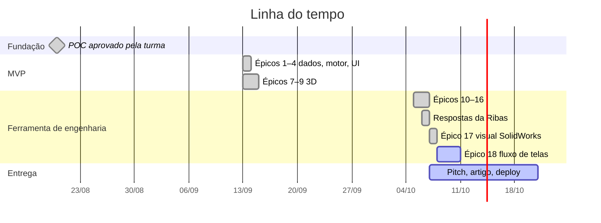

# 🗺️ Roadmap

Organizado em **Épicos → Tasks**. Esta nota é a visão de acompanhamento; o detalhe de cada épico (tasks, sub-tasks, achados, verificações e a sprint do backlog) está numa nota própria na pasta `Épicos/`, linkada na tabela abaixo.

## Épicos

| # | Épico | Status | Data | Resultado |
|---|---|---|---|---|
| [[Épico 00 — Fundamentos e protótipo\|0]] | Fundamentos e POC | ✅ | 20/08/2026 | Web app decidido; POC SVG aprovado pela turma |
| [[Épico 01 — Dados reais dos fabricantes\|1]] | Dados reais dos fabricantes | ✅ | 13/09/2026 | Tabelas MD-300L (principal + JIB) e TM-130 em JSON, conferidas |
| [[Épico 02 — Motor de cálculo v2\|2]] | Motor de cálculo v2 | ✅ | 13/09/2026 | Interpolação, somatório, arredondamento para baixo, geometria; 28 testes |
| [[Épico 03 — Interface de produção\|3]] | Interface de produção | ✅ | 13/09/2026 | React + canvas, JIB, campos sincronizados, busca reversa |
| [[Épico 04 — Alertas, validação e usabilidade\|4]] | Alertas e usabilidade | ✅ | 13/09/2026 | Indicador de status; bug de digitação no raio corrigido |
| [[Épico 05 — Testes finais, pitch e artigo\|5]] | Testes finais, pitch e artigo | 🟡 | — | e2e prontos; **falta gravar o vídeo e fechar o artigo** |
| [[Épico 06 — Melhorias futuras\|6]] | Melhorias futuras | ⬜ | — | Cadastro de guindastes (RF13), PWA, CI, etc. |
| [[Épico 07 — Cena 3D e tela cheia\|7]] | 3D (WebGL) e tela cheia | ✅ | 13/09/2026 | react-konva → react-three-fiber |
| [[Épico 08 — UI industrial e arrasto do comprimento\|8]] | UI industrial + arrasto do comprimento | ✅ | 14/09/2026 | Tema escuro (depois substituído no Épico 12), medidor |
| [[Épico 09 — Guindaste 3D realista\|9]] | Guindaste 3D realista + campos na cena | ✅ | 14/09/2026 | Modelo detalhado, marcas de encaixe magnéticas |
| [[Épico 10 — Dados corrigidos e motor v3\|10]] | Dados corrigidos e motor v3 | ✅ | 06/10/2026 | `avaliarCenario`, sem dado, giro → área, tabela polar do TM-130 |
| [[Épico 11 — Fonte única de estado\|11]] | Fonte única de estado | ✅ | 05/10/2026 | Cenário como único estado; todos os parâmetros editáveis |
| [[Épico 12 — Interface estilo SolidWorks\|12]] | Interface estilo SolidWorks | ✅ | 05/10/2026 | Barra de comandos, árvore, cubo, vistas, cotas, status |
| [[Épico 13 — Modelo 3D fiel e arrasto de tudo\|13]] | Modelo 3D fiel + arrasto de tudo | ✅ | 05/10/2026 | Centro de giro como origem; giro, sapatas, JIB, carga arrastáveis |
| [[Épico 14 — Mapa da área de operação\|14]] | Mapa da área de operação | ✅ | 05/10/2026 | OK/NOK/sem dado pintado no chão |
| [[Épico 15 — Projetos, orçamentos e cenários\|15]] | Projetos, orçamentos e cenários | ✅ | 05/10/2026 | IndexedDB, CRUD, comparação, JSON |
| [[Épico 16 — Relatório PDF\|16]] | Relatório PDF | ✅ | 06/10/2026 | PDF por cenário e por orçamento, com assinatura |
| — | Respostas da Ribas | ✅ | 06/10/2026 | ±55° confirmado, 85° da ficha, nº de pernas vazio no TM-130 |
| [[Épico 17 — Visual SolidWorks\|17]] | Visual SolidWorks e área de trabalho | ✅ | 07/10/2026 | CommandManager, FeatureManager/PropertyManager, veredito em frase |
| [[Épico 18 — Fluxo de telas\|18]] | Fluxo de telas | ⬜ | — | Início → Projeto → Carga → Guindaste → Simulação → Verificação → Relatório |

## Versões

O `package.json` ainda está em `0.1.0`. Proposta de leitura das entregas como versões funcionais (a confirmar ao fazer o primeiro deploy):

| Versão | Conteúdo | Critério de pronto |
|---|---|---|
| **v0.1** — POC | Diagrama SVG arrastável com dados fictícios | Aprovado pela turma ✅ |
| **v0.5** — MVP | Épicos 1–4: dados reais, motor, interface 2D, busca reversa | Capacidade exata contra a tabela ✅ |
| **v0.8** — 3D | Épicos 7–9: cena WebGL, modelo realista | e2e de arrasto passando ✅ |
| **v1.0** — Ferramenta de engenharia | Épicos 10–16 + respostas da Ribas | 152 unitários + 22 e2e ✅ |
| **v1.1** — Interface profissional | Épicos 17 (visual SolidWorks ✅) e 18 (fluxo de telas) | Fluxo completo Início → PDF coberto por e2e |
| **v1.2** — Publicação | Deploy no Vercel, CI no GitHub, pendências técnicas pequenas | Link público estável |
| **v1.3** — Dados da Ribas | Massa linear do cabo, nº de pernas do TM-130, JIB do TM-130, 0° do TM-130 | Sem "sem dado" por falta de informação da empresa |
| **v2.0** — Frota aberta | Épico 6: cadastro de guindastes e tabelas (RF13) | Um terceiro guindaste entra sem mexer no código |

## Sprints

Cada épico teve uma sprint no backlog (S1 = Épico 1 … S14 = Épico 16; a Sprint 4 cobriu os Épicos 4 e 5). A tabela de tarefas de cada sprint (IDs `S1-01` etc.) está na seção "Sprint (visão do backlog)" da nota do épico.

## Épico 6 — candidatos

- [ ] Cadastro/administração de guindastes e tabelas (RF13)
- [ ] PWA instalável para uso offline na obra
- [ ] CI no GitHub Actions (test + build + e2e)
- [ ] Undo/redo do cenário
- [ ] Linha vermelha da ficha do MD-300L (limite estrutural × estabilidade por célula)
- [ ] Responsividade para tablet

## Relacionado

- [[✅ Próximos Passos]]
- [[🗓️ Log de Atualizações]]
- [[📈 Indicadores]]
- [[🗂️ Simulador Guindastes Ribas]]
